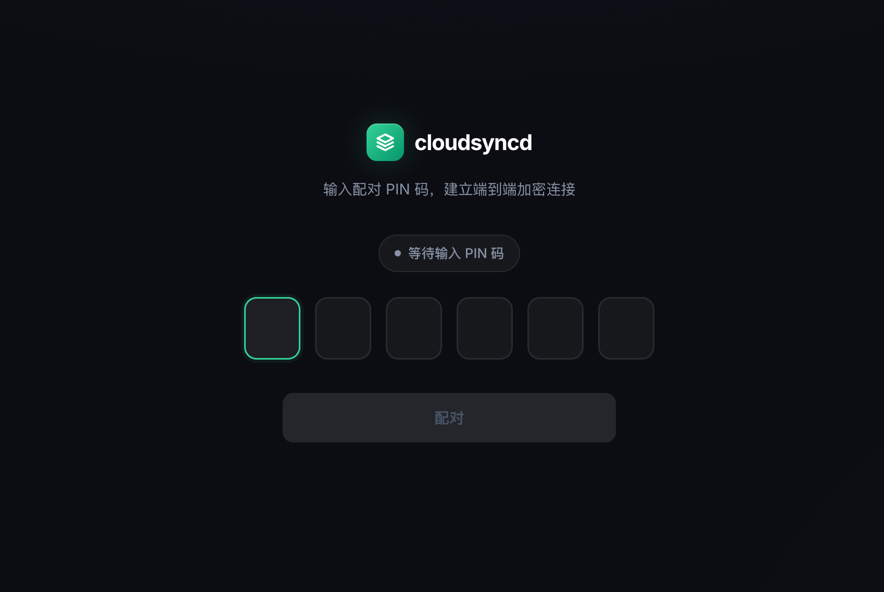
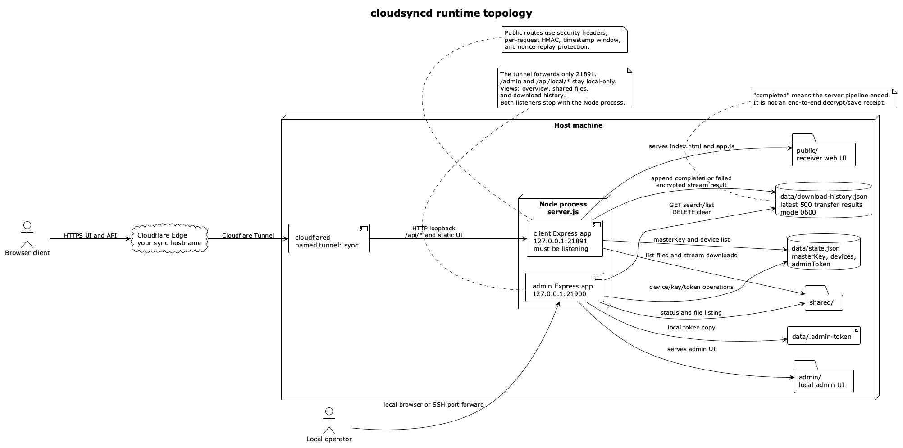
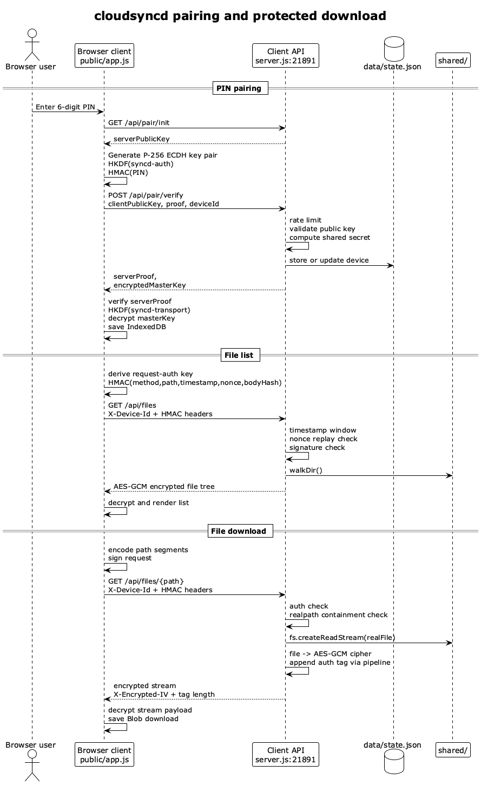

# cloudsyncd

原始仓库: https://github.com/toads/cloudsysncd

一个轻量的 Node.js 文件 / 文本同步服务。服务端生成一次性 PIN，浏览器客户端通过 ECDH + HKDF 协商主密钥；配对后的受保护请求使用 `deviceId + timestamp + nonce + HMAC` 做逐请求鉴权，文件与文本内容在传输时加密。

当前仓库按私人部署维护。默认服务只绑定本机回环地址，适合通过 Cloudflare Tunnel 或 SSH 端口转发访问，不建议把 Node 服务端口直接暴露到公网。

架构图和关键协议流程见 [docs/architecture.md](./docs/architecture.md)。



## 架构图

### 运行拓扑



### 配对和下载流程



## 功能

- 浏览器端 PIN 配对
- `shared/` 运行态目录文件共享、单文件下载和批量下载
- 文本共享接口
- 配对设备列表、单设备撤销、全部撤销
- 主密钥轮换和管理 Token 轮换
- 本地管理面板（Admin UI）
- 可选 Cloudflare Tunnel 部署

## 目录说明

- `server.js`: Express 服务端，同时启动客户端端口和本地管理端口
- `public/`: 浏览器客户端页面
- `admin/`: 本地管理面板
- `docs/architecture.md`: 运行拓扑和配对 / 下载流程图
- `pin.js`: 通过本地管理端口生成新 PIN
- `devices.js`: 设备列表、撤销、主密钥轮换、管理 Token 轮换
- `share.js`: 把文件或目录加入 `shared/`，默认使用硬链接，失败时回退复制
- `cloudflared-config.example.yml`: Cloudflare Tunnel 配置模板
- `cloudflared-config.yml`: 本地私有 Tunnel 配置，默认忽略，不提交
- `data/`: 运行时状态，保存主密钥、已配对设备和管理 Token，必须保持忽略
- `shared/`: 运行时共享载荷目录，必须保持忽略

## 环境要求

- Node.js 20+
- npm 10+
- `cloudflared`（仅在使用 Cloudflare Tunnel 时需要）

## 快速开始

```bash
npm install
npm start
```

默认启动两个本地监听端口：

- 客户端：`http://127.0.0.1:21891`
- 管理端：`http://127.0.0.1:21900/admin`

首次启动时，如果没有已配对设备，服务端会在终端打印 6 位 PIN。打开客户端页面输入 PIN 完成配对后即可浏览和下载 `shared/` 中的文件。

## 常用命令

加入共享文件或目录：

```bash
node share.js file1.pdf dir1 another.txt
node share.js --copy file1.pdf      # 强制复制，不使用硬链接
```

查看或清空共享目录：

```bash
node share.js --list
node share.js --clear
```

为新设备生成 PIN：

```bash
node pin.js
```

列出 / 撤销已配对设备：

```bash
node devices.js                 # 列出所有已配对设备
node devices.js --revoke <id>   # 撤销单个设备
node devices.js --revoke-all    # 撤销全部设备
node devices.js --rotate-key    # 轮换主密钥并清空全部设备
node devices.js --rotate-token  # 轮换管理 Token
```

撤销会立即把设备从服务端清单中移除，后续请求会被拒绝。撤销单个设备不会轮换主密钥；如果怀疑主密钥泄露，使用 `--rotate-key` 强制所有设备重新配对。

## 管理端

管理端是 `devices.js` / `pin.js` 的图形化版本，只绑定本机回环地址。Cloudflare Tunnel 只转发客户端端口 `21891`，所以公网域名不会暴露 `/admin`、`/admin.js` 或 `/api/local/*`。

打开：

```text
http://127.0.0.1:21900/admin
```

远程管理时使用 SSH 端口转发：

```bash
ssh -L 21900:127.0.0.1:21900 user@server
```

管理 Token 在服务器 `data/.admin-token` 文件中，持久化在 `data/state.json`，重启不会变化。可以在管理面板中轮换，也可以运行 `node devices.js --rotate-token`。

## 环境变量

- `PORT`: 客户端监听端口，默认 `21891`
- `HOST`: 客户端绑定地址，默认 `127.0.0.1`
- `ADMIN_PORT`: 管理端监听端口，默认 `21900`
- `ADMIN_HOST`: 管理端绑定地址，默认 `127.0.0.1`
- `WITH_TUNNEL`: 设为 `1` 时，`start.sh` 会同时拉起 Cloudflare Tunnel
- `TUNNEL_CONFIG`: Cloudflare Tunnel 配置文件路径，默认 `cloudflared-config.yml`

只有在清楚网络边界时才把 `HOST` 或 `ADMIN_HOST` 改成 `0.0.0.0`。管理端通常应始终保持本机可达。

## Cloudflare Tunnel

仓库只保留 `cloudflared-config.example.yml` 模板。真实的 `cloudflared-config.yml` 包含 tunnel ID、hostname 和凭证文件路径，默认被 `.gitignore` 忽略，不应提交。

首次配置：

```bash
cp cloudflared-config.example.yml cloudflared-config.yml
# 编辑 cloudflared-config.yml，填入自己的 tunnel、credentials-file 和 hostname
```

目标拓扑是将你的公网 hostname 转发到本机 `127.0.0.1:21891`。

日常启动：

```bash
WITH_TUNNEL=1 ./start.sh
```

或服务已运行时单独启动隧道：

```bash
cloudflared tunnel --config cloudflared-config.yml run <tunnel-name>
```

迁移到其他机器或域名时，需要重新创建 Cloudflare Tunnel，并只更新本地 `cloudflared-config.yml`。

没有固定域名时，可以临时使用：

```bash
cloudflared tunnel --url http://127.0.0.1:21891
```

## 安全边界

- `data/state.json` 含主密钥和管理 Token，`data/` 必须保持忽略
- `shared/` 是运行态共享目录，内容会对已配对设备可见，必须保持忽略
- 浏览器客户端会把主密钥保存在 IndexedDB
- 所有已配对设备共享同一个主密钥；主密钥轮换会让全部设备重新配对
- Cloudflare Tunnel 只提供入口转发，不等价于应用层访问控制；需要额外身份门禁时，在 Cloudflare Zero Trust 中配置 Access

更多检查项见 [OPEN_SOURCE_AUDIT.md](./OPEN_SOURCE_AUDIT.md)。

## 发布检查

```bash
git status --short
git ls-files
```

发布或推送前确认：

- `data/` 未被提交
- `shared/` 中没有运行态载荷被提交
- `.env`、Cloudflare 凭证、日志、下载缓存未被提交
- 如需公开仓库，先移除或模板化私有域名、隧道 UUID、绝对路径和个人部署信息

## 已知限制

- 没有用户 / 角色系统，只有设备级配对和撤销
- 没有单文件或单设备 ACL，配对设备可访问 `shared/` 下的所有非隐藏文件
- 文本消息只保存在服务进程内存中，重启会丢失
- 当前仓库不再内置 Python 自动下载客户端
