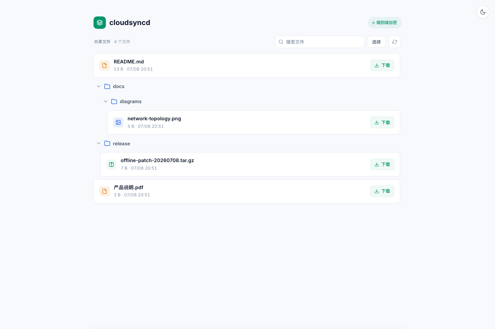

# cloudsyncd

> 基于原始项目 [toads/cloudsysncd](https://github.com/toads/cloudsysncd) 继续开发。

自托管的加密文件分享服务，面向浏览器和命令行接收端。分享端通过一次性 PIN 完成设备配对，随后使用请求签名和 AES-GCM 加密保护文件与文本传输。



## 功能

- 分享端与接收端职责分离，提供统一的 `cloudsyncd` CLI。
- 一次性 PIN 配对，配对后使用设备 ID、时间戳、nonce 和 HMAC 鉴权。
- 浏览器和 CLI 均支持大文件分块、流式解密。
- 支持 Cloudflare Tunnel 固定域名，也可仅在本机或 SSH 端口转发中使用。
- 本地管理端提供设备、共享文件、密钥和下载记录管理。
- 公网客户端端口与本地管理端口完全分离。

## 环境要求

- Node.js 18 或更高版本
- npm
- `cloudflared`，仅在使用 Cloudflare Tunnel 时需要

## 安装

```bash
git clone https://github.com/DoubleMice/cloudsyncd.git
cd cloudsyncd
npm install
npm link
```

`npm link` 会把 `cloudsyncd` 注册到当前用户的 PATH。卸载命令：

```bash
npm unlink -g cloudsyncd
```

不安装全局命令也可以运行：

```bash
npm exec -- cloudsyncd --help
```

## 快速开始

在文件所有者的电脑上启动分享端：

```bash
cloudsyncd server start
```

在另一个终端添加共享文件并生成配对 PIN：

```bash
cloudsyncd share ./file.pdf
cloudsyncd server pin
```

接收端第一次访问时会自动进入配对流程：

```bash
cloudsyncd client list http://127.0.0.1:21891
cloudsyncd client get http://127.0.0.1:21891 "file.pdf"
```

默认服务地址：

| 界面 | 地址 | 暴露范围 |
| --- | --- | --- |
| 浏览器接收端 | `http://127.0.0.1:21891` | 本机或 Tunnel |
| 管理端 | `http://127.0.0.1:21900/admin` | 仅本机 |

管理端包含“概览”“共享文件”“下载记录”三个页签。更新服务端代码后需要重启 `cloudsyncd`，新增接口才会生效。

## 运行与重启

`cloudsyncd server start` 默认以前台进程运行，终端关闭后服务也会停止。开发或本地使用时，保持启动终端打开；重启时在该终端按 `Ctrl+C`，然后重新执行：

```bash
cloudsyncd server start
```

确认接收端和管理端都已恢复：

```bash
curl -i http://127.0.0.1:21891/api/status
curl -i http://127.0.0.1:21900/api/local/status
```

长期运行时应交给 `launchd`、`systemd` 或其他进程管理器托管，不要依赖临时终端会话。Cloudflare Tunnel 可以继续运行，但 Node origin 停止后接收端将不可用。

## CLI

分享端常用命令：

```bash
cloudsyncd server start [--tunnel]
cloudsyncd server status
cloudsyncd share <paths...> [--copy]
cloudsyncd share list
cloudsyncd share clear
cloudsyncd server pin
cloudsyncd server devices
cloudsyncd server revoke <device-id>
cloudsyncd server revoke-all
cloudsyncd server rotate-key
```

接收端常用命令：

```bash
cloudsyncd client list <share-url> [--json] [--pin <PIN>]
cloudsyncd client get <share-url> <remote-path> [-o <path>] [--force]
cloudsyncd client batch <share-url> [-o <file.tar.gz>] [--since <ISO>]
cloudsyncd client logout <share-url>
```

完整参数以 `cloudsyncd --help` 为准。

## Cloudflare Tunnel

创建 named tunnel 并生成本地配置：

```bash
cloudflared tunnel login
cloudflared tunnel create sync
cp config/cloudflared.example.yml cloudflared-config.yml
cloudsyncd server tunnel setup
cloudsyncd server start --tunnel
```

`cloudflared-config.yml` 包含本地 tunnel ID、hostname 和 credentials 路径，已被 Git 忽略。模板文件不包含真实部署信息。

Tunnel 管理命令：

```bash
cloudsyncd server tunnel validate
cloudsyncd server tunnel route-dns sync.example.com
cloudsyncd server tunnel start
cloudsyncd server tunnel stop
```

## 架构


Cloudflare Tunnel 只转发接收端口 `21891`。管理端口 `21900` 默认绑定回环地址，`/admin` 和 `/api/local/*` 不经过公网入口。

详细拓扑、服务重启和配对下载时序见 [架构文档](./docs/architecture.md)。

## 项目结构

```text
cloudsyncd/
├── admin/                 # 本地管理端
├── bin/                   # cloudsyncd CLI 入口
├── config/                # 配置模板
├── docs/                  # 架构文档、图表和截图
│   ├── assets/
│   └── diagrams/
├── lib/                   # CLI、协议和客户端实现
├── public/                # 浏览器接收端
├── scripts/               # 兼容与运维脚本
├── tests/                 # 单元测试和 Playwright E2E
├── server.js              # 分享端服务入口
└── package.json
```

`data/`、`shared/`、`downloads/` 和 `cloudflared-config.yml` 都是本地运行内容，不应提交。

## 安全说明

- 不要直接把 Node.js 端口暴露到公网；推荐使用 Cloudflare Tunnel 或 SSH 端口转发。
- 所有已配对设备共享同一个主密钥；轮换主密钥后，全部设备需要重新配对。
- 浏览器把配对密钥保存在 IndexedDB；Service Worker 仅在下载期间于内存中持有下载所需密钥。
- 下载记录最多保存 500 条服务端传输结果。“完成”表示加密响应流发送结束，不代表接收端一定完成解密和落盘。
- `data/` 包含密钥、设备和下载元数据，服务端会将目录权限收紧为 `0700`、文件权限收紧为 `0600`。

## 开发

```bash
npm test
npm run test:e2e
npm audit --omit=dev
```

修改 PlantUML 图表后重新生成：

```bash
plantuml -tpng docs/diagrams/*.puml
plantuml -tsvg docs/diagrams/*.puml
```

## License

[ISC](./LICENSE)
