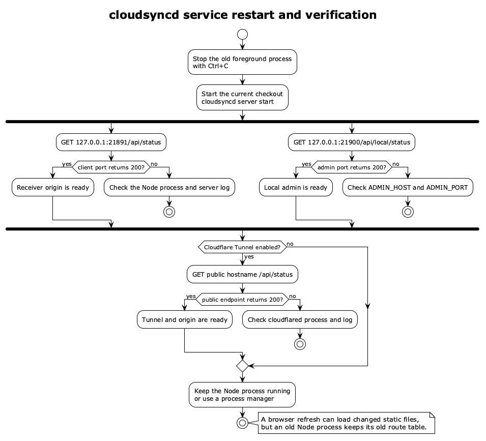

# cloudsyncd 架构说明

本文档记录当前代码实现中的运行拓扑和核心协议流程。图源文件位于 `docs/diagrams/*.puml`，渲染产物位于同一目录。

## 运行拓扑


对应源码：

- `scripts/start.sh`: 兼容启动脚本，可选拉起 `cloudflared tunnel --config ... run sync`
- `config/cloudflared.example.yml`: 展示将公网 hostname 转发到 `http://127.0.0.1:21891` 的模板
- `server.js`: 同一 Node 进程中启动两个 Express app
- `public/`: 公网客户端 UI，只经客户端端口访问
- `admin/`: 本地管理 UI，只经管理端口访问
- `data/`: 运行态主密钥、设备列表、管理 token 和下载传输记录
- `shared/`: 运行态共享文件目录

关键边界：

- 客户端端口默认绑定 `127.0.0.1:21891`，面向 Cloudflare Tunnel。
- 管理端口默认绑定 `127.0.0.1:21900`，不在 tunnel ingress 规则中。
- 公网 hostname 只应到达客户端 Express app；`/admin`、`/admin.js`、`/api/local/*` 不应通过公网命中管理端。
- HSTS 不在 Node origin 上设置；origin 是本机 HTTP，公网 HTTPS 由 Cloudflare 边缘终止。
- Cloudflare Tunnel 与 Node origin 是独立进程；如果 `server.js` 没有监听 `127.0.0.1:21891`，接收端将不可用。
- 同一个 Node 进程同时提供 `21891` 和 `21900`；进程退出后，接收端和管理端会一起离线。

## 服务启动与重启



`cloudsyncd server start` 是前台命令。关闭启动终端或结束进程会同时停止客户端和管理端监听。代码升级后，应先终止旧进程，再从仓库的新版本重新启动；仅刷新浏览器不会重新注册 Express 路由。

重启后依次验证：

```bash
curl -i http://127.0.0.1:21891/api/status
curl -i http://127.0.0.1:21900/api/local/status
curl -i http://127.0.0.1:21900/api/local/downloads
```

前两个端口应由同一个 `node` 进程监听。长期部署应使用操作系统进程管理器负责启动、退出和自动重启；Tunnel 与 Node origin 是两个独立生命周期。

## 本地管理端

管理端按任务拆为三个一级页签：

- 概览：服务状态、设备配对与撤销、主密钥和可选管理 Token 轮换。
- 共享文件：搜索、上传、单个删除、多选删除和清空 `shared/`。
- 下载记录：按文件名或设备 ID 搜索记录，并可清空历史。

下载请求的加密响应流结束后，服务端把文件名、设备 ID、大小、开始/结束时间和成功/失败状态写入 `data/download-history.json`。历史按新到旧排列并限制为 500 条，文件权限为 `0600`。管理端通过本地接口 `GET /api/local/downloads` 查询，通过 `DELETE /api/local/downloads` 清空。

记录中的“完成”只表示服务端 pipeline 已把加密响应发送完毕。浏览器或 CLI 后续解密、用户取消、磁盘写入失败不一定能反馈给分享端，因此这不是端到端接收回执。

Express 路由只在 Node 进程启动时注册。更新 `server.js` 后必须重启服务；如果只刷新页面而仍运行旧进程，管理端会提示下载记录接口尚未启用。

## 配对和下载流程


当前协议分三层：

1. PIN 配对：浏览器和服务端用 P-256 ECDH 协商共享秘密，并用 `HKDF(syncd-auth)` 证明用户知道一次性 PIN。
2. 设备请求鉴权：配对后，浏览器从主密钥派生 request-auth key，请求携带 `X-Device-Id`、`X-Auth-Timestamp`、`X-Auth-Nonce`、`X-Auth-Signature`。
3. 内容传输加密：文件列表用 JSON + AES-GCM 返回；下载使用 AES-GCM 流式响应。浏览器优先由同源 Service Worker 分块解密并交给浏览器下载管理器，无法使用时回退到 File System Access 流式写入；CLI 同样进行分块流式解密。

服务端对下载路径做两层检查：

- URL 路径先拼到 `shared/` 下。
- 再用 `fs.realpathSync` 和 `path.relative` 确认真实文件仍位于真实 `shared/` 根目录之下，避免符号链接或路径前缀绕过。

## 图文件

- PlantUML 源码: [runtime-topology.puml](./diagrams/runtime-topology.puml)
- PNG: [runtime-topology.png](./diagrams/runtime-topology.png)
- SVG: [runtime-topology.svg](./diagrams/runtime-topology.svg)
- PlantUML 源码: [service-restart.puml](./diagrams/service-restart.puml)
- PNG: [service-restart.png](./diagrams/service-restart.png)
- SVG: [service-restart.svg](./diagrams/service-restart.svg)
- PlantUML 源码: [pairing-download-sequence.puml](./diagrams/pairing-download-sequence.puml)
- PNG: [pairing-download-sequence.png](./diagrams/pairing-download-sequence.png)
- SVG: [pairing-download-sequence.svg](./diagrams/pairing-download-sequence.svg)
