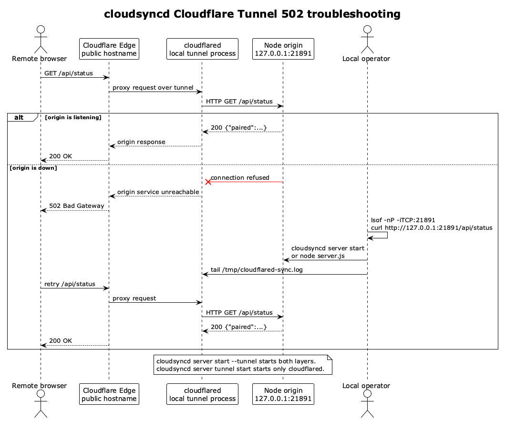

# cloudsyncd 架构说明

本文档记录当前代码实现中的运行拓扑和核心协议流程。图源文件位于 `docs/diagrams/*.puml`，渲染产物位于同一目录。

## 运行拓扑


对应源码：

- `start.sh`: 从仓库目录启动 `server.js`，可选拉起 `cloudflared tunnel --config ... run sync`
- `cloudflared-config.example.yml`: 展示将公网 hostname 转发到 `http://127.0.0.1:21891` 的模板
- `server.js`: 同一 Node 进程中启动两个 Express app
- `public/`: 公网客户端 UI，只经客户端端口访问
- `admin/`: 本地管理 UI，只经管理端口访问
- `data/`: 运行态主密钥、设备列表和管理 token
- `shared/`: 运行态共享文件目录

关键边界：

- 客户端端口默认绑定 `127.0.0.1:21891`，面向 Cloudflare Tunnel。
- 管理端口默认绑定 `127.0.0.1:21900`，不在 tunnel ingress 规则中。
- 公网 hostname 只应到达客户端 Express app；`/admin`、`/admin.js`、`/api/local/*` 不应通过公网命中管理端。
- HSTS 不在 Node origin 上设置；origin 是本机 HTTP，公网 HTTPS 由 Cloudflare 边缘终止。
- Cloudflare Tunnel 注册成功只说明公网到 `cloudflared` 的连接可用；如果 `server.js` 没有监听 `127.0.0.1:21891`，公网仍会返回 502。

## 502 排障流程



公网 502 通常发生在 `cloudflared -> 127.0.0.1:21891` 这一段。按下面顺序检查：

1. 确认本机 origin 是否监听：

   ```bash
   lsof -nP -iTCP:21891 -sTCP:LISTEN
   curl -i http://127.0.0.1:21891/api/status
   ```

2. 确认 tunnel 进程和日志：

   ```bash
   ps -ef | rg cloudflared
   tail -n 80 /tmp/cloudflared-sync.log
   ```

3. 若日志出现 `connect: connection refused`，说明 tunnel 正常但 Node origin 没运行。启动服务：

   ```bash
   cloudsyncd server start
   ```

4. 若要一次启动服务和 tunnel：

   ```bash
   cloudsyncd server start --tunnel
   ```

5. 重新验证公网健康：

   ```bash
   curl -i https://<your-sync-hostname>/api/status
   ```

## 配对和下载流程


当前协议分三层：

1. PIN 配对：浏览器和服务端用 P-256 ECDH 协商共享秘密，并用 `HKDF(syncd-auth)` 证明用户知道一次性 PIN。
2. 设备请求鉴权：配对后，浏览器从主密钥派生 request-auth key，请求携带 `X-Device-Id`、`X-Auth-Timestamp`、`X-Auth-Nonce`、`X-Auth-Signature`。
3. 内容传输加密：文件列表用 JSON + AES-GCM 返回；单文件和批量下载走 AES-GCM 流式响应，服务端通过完整 pipeline 追加 GCM tag，浏览器解密后保存 Blob。

服务端对下载路径做两层检查：

- URL 路径先拼到 `shared/` 下。
- 再用 `fs.realpathSync` 和 `path.relative` 确认真实文件仍位于真实 `shared/` 根目录之下，避免符号链接或路径前缀绕过。

## 图文件

- PlantUML 源码: [runtime-topology.puml](./diagrams/runtime-topology.puml)
- PNG: [runtime-topology.png](./diagrams/runtime-topology.png)
- SVG: [runtime-topology.svg](./diagrams/runtime-topology.svg)
- PlantUML 源码: [tunnel-502-troubleshooting.puml](./diagrams/tunnel-502-troubleshooting.puml)
- PNG: [tunnel-502-troubleshooting.png](./diagrams/tunnel-502-troubleshooting.png)
- SVG: [tunnel-502-troubleshooting.svg](./diagrams/tunnel-502-troubleshooting.svg)
- PlantUML 源码: [pairing-download-sequence.puml](./diagrams/pairing-download-sequence.puml)
- PNG: [pairing-download-sequence.png](./diagrams/pairing-download-sequence.png)
- SVG: [pairing-download-sequence.svg](./diagrams/pairing-download-sequence.svg)
